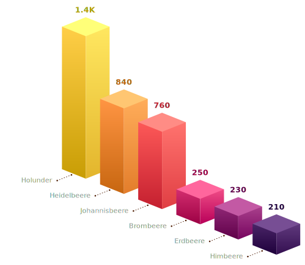

import Favorites from "@/components/sections/Favorites.astro";

## Inhaltsverzeichnis

## Das Naturprodukt Holunder zeigt wissenschaftlich erwiesene Effekte für das Immunsystem.

Bereits [Hippocrates](https://whoswho.de/bio/hippokrates.html) (ca. 460 - 370 v. Chr.), der bedeutendste Arzt der Antike, berichtete von der positiven Wirkung des Holunders auf die Gesundheit. Und auch im Volksmund heißt es ehrfürchtig: "Vor dem Holder soll man den Hut ziehen" (Holder = Holunder). Neueste wissenschaftliche Erkenntnisse bestätigen seine Wirkung.

Die Gattung des Holunders zählt über 25 Arten, wovon der Schwarze Holunder (Sambucus nigra L.) am bekanntesten ist. Er ist dunkler und intensiver als der bekannte Strauch- und Wildholunder, der an vielen Wegrändern wächst.

Der Schwarze Holunder ist eine der ältesten und wertvollsten Heilpflanzen in unseren Breitengraden. Auch bei der verheerenden Spanischen Grippe Pandemie von 1918 bis 1919 war der Schwarze Holunder eine der wichtigsten und meistverwendeten Heilpflanzen.

## Wie wirkt Schwarzer Holunder? 

Schwarzer Holunder hat eine ganze Latte an positiven Eigenschaften. Er wirkt:

- Antioxidativ

- Antiinflammatorisch (entzündungshemmend)

- Immunmodulatorisch (d. h. er wirkt auf dein Immunsystem ein und stärkt es)

- Antiviral

- Antibakteriell

- Gefäßprotektiv (schützt die Gesundheit deiner Gefäße)

- Er reguliert den Fett- und Insulinstoffwechsel

Du siehst also, dass der Schwarze Holunder nicht umsonst gelobt wird, denn er erweist uns viele hilfreiche Dienste für die Gesundheit.

## Antivirale Wirkung

Es lohnt sich, die antivirale Wirkung der Flavonoide (Polyphenole im Schwarzen Holunder) einmal genauer anzuschauen. Zum einen blockieren diese Flavonoide die Oberfläche der Viruspartikel. Dadurch werden Sie davon abgehalten, an den Wirtszellen (deinen!) anzudocken, einzudringen und sich zu vervielfältigen. Das verhindert eine Infektion oder lindert diese ab.

Zudem zeigen die Anthocyane des Schwarzen Holunders eine antivirale Aktivität, indem sie diese blockieren und ebenfalls die Vervielfältigung des Virus verhindern.

## Sekundäre Pflanzenstoffe

Werfen wir einmal einen genaueren Blick auf die Inhaltsstoffe dieser heimischen Pflanze.

Eine besondere Bedeutung für die Gesundheit haben die Farbstoffe der Beere. Eine **Unterkategorie der sekundären Pflanzenstoffe sind die sogenannten Polyphenole** (es gibt auch noch andere Kategorien von sekundären Pflanzenstoffen, z.B. Carotinoide, Phytoöstrogene usw.).

Die Polyphenole umfassen wiederum mehrere Kategorien. **Von besonderer Bedeutung sind hier die sogenannten Anthocyane, von denen der Schwarze Holunder am meisten von allen Pflanzen enthält.** Genauer gesagt, **speziell der Schwarze Holunder der Sorte Haschberg** enthält eine einzigartige Mischung an sekundären Pflanzenstoffen mit den unterschiedlichsten Anthocyanen (Studie von Oszmiański et al.)

Auch andere dunkelrote Beeren, wie z. B. Him- oder Heidelbeeren enthalten Anthocyane. Allerdings übertrifft der schwarze Holunder andere Pflanzen bei weitem in der Menge der enthaltenen Polyphenole. Das kannst du in dem Schaubild sehen.

**Einheit: mg pro 100 g,** Quelle: Mtynarcyk k. et al

## Was sind Anthocyane?

Anthocyane sind die Radikalfänger der Natur. Das heißt, es sind natürliche, wasserlösliche Pflanzenfarbstoffe, die den Körper vor freien Radikalen und dadurch die Zellen vor oxidativem Stress schützen. Sie halten dich sozusagen jung und gesund.

Wissenschaftliche Studien bestätigen die natürliche Wirkung von Anthocyanen und vor allem ihre Wirkung für das Immunsystem ist erwiesen.

## Welche anderen Stoffe enthält Schwarzer Holunder noch?

Abgesehen davon, dass der schwarze Holunder eine besonders polyphenolreiche Beerenfrucht ist, enthält er auch noch:

Flavonole (eine weitere Kategorie der Polyphenole), wie z. B. :

- Quercetin

- Rutin

- Kämpferol

- Immunmodulatorisch (regulieren das Immunsystem) wirksame Polysaccharide (Mehrfachzucker)

- Vitamin C

- B-Vitamine

- Viel Kalium

- Kalzium

## Quercetin 

Ich kann hier nicht über alle diese Stoffe schreiben, denn dann wird der Artikel so lang, dass ihn niemand mehr liest. Aber ich möchte ganz knapp auf Quercetin eingehen (was einen eigenen Artikel verdient. Kommt noch….). Denn Quercetin ist auch so ein gesunder Power-Stoff. Es hat nämlich die folgenden Wirkungen:

- wirkt vielseitig neuroprotektiv (schützt deine Nervenzellen)

- mindert oxidativen Stress

- schützt die DNA (dein Erbgut), Mitochondrien und Neuronen (Nervenzellen)

- Antiinflammatorische Wirkung (entzündungshemmend)

- verbessert die Neurotransmitter – und Rezeptorfunktionen (das kannst du dir vorstellen wie die Signalübermittlung in deinen Nervenzellen)

- Wirkt dem Zelltod der Neuronen (Nervenzellen) entgegen

Quercetin kommt natürlich z. B. in Zwiebeln, Äpfel, Beeren, Quitten und grünen Gemüsearten vor. Und weißt du was - **am allermeisten Quercetin enthält - Tata - der Schwarze Holunder!**

## Unterstützung für dein Immunsystem

Du siehst also, dass der Schwarze Holunder nur Gutes zu bieten hat. Der einzige Nachteil ist, dass die Beeren natürlich nur in Saison in der Natur vorkommen und du vielleicht auch nicht gerade ständig Zeit hast, auf Tour zu gehen, um das Kraftfutter zum Zweck der Bereicherung deines Speiseplans zu sammeln. Zumal eben die Sorte Haschberg die besten Inhaltsstoffe liefert und die nicht an jeder Ecke wächst.

Aber, die gute Nachricht ist, es gibt den Schwarzen Holunder der Sorte Haschberg als Nahrungsergänzung zu kaufen. Das heißt, du kannst ihn zur Unterstützung deines Immunsystems und deiner Gesundheit ganz einfach in deine tägliche Routine einbauen.

## Die Dosis machts

Wie bei allem, was wir so zu uns nehmen, ist auch beim Schwarzen Holunder die Dosis wichtig. Um die Wirkungsweisen zu erreichen, die in Studien belegt sind (siehe unten), solltest du **täglich mindestens 45 mg Anthocyane** des Schwarzen Holunders zu dir nehmen. Eine Kapsel unseres Favoriten enthält mit 300 mg des Holunderbeerenextraktes exakt diese Menge. Ein weiterer Vorteil der Verabreichung von Trockenextrakt ist, dass die darin enthaltenen sekundären Pflanzenstoffe mit deren Anthocyanen über Jahre stabil bleiben. Demgegenüber bauen sie sich z.B. in Saft relativ schnell ab.

## Auf die Qualität kommts an

‘Eine 2022 veröffentlichte Studie (Stich et al.) belegt, dass das Beerenextrakt unseres Favoriten Rubyni sogar **positive präbiotische Effekte hat, also auf dein Darm-Mikrobiom wirkt**. Das Mikrobiom hat einen Mega Einfluss auf dein Immunsystem und setzt sich aus Billionen von Bakterien in deinem Darm zusammen. Präbiotika sind sozusagen “Futter” für diese gesunden Bakterien, die du brauchst. In den letzten Jahren hat sich gezeigt, dass nicht nur unverdauliche Ballaststoffe (z.B. Pflanzenfasern), sondern auch pflanzliche Polyphenole (eine Untergruppe der sekundären Pflanzenstoffe) präbiotisch wirken.

Die Studie zeigte einen **stark positiven Anstieg der Diversität des Mikrobioms** zu Beginn und nach Ende der Einnahme des Holunderbeerenextraktes. Das bedeutet, mehrere Bakterien-Gattungen wurden positiv beeinflusst und haben sich vermehrt. **Und allgemein kann man sagen, je mehr Diversität dein Mikrobiom aufweist, um so gesünder bist du.**

<Favorites data={frontmatter.favorites} />

## Wissenschaftliche Studien bestätigen die positive Wirkung

Bereits 2004 wurde durch eine Placebo-kontrollierte klinische Studie in Norwegen die Wirkung von Holunderbeerenextrakt bestätigt, die als eine der bedeutsamsten diesbezüglich gilt. Die Doppelblindstudie umfasste 60 Teilnehmer und ergab, dass eine Behandlung mit Schwarzem Holunder die Symptome von Erkältungen signifikant schneller linderte als ein Placebo. Diese Studie wurde in der Zeitschrift “Journal of International Medical Research” veröffentlicht.

2016 bestätigte eine Placebo-kontrollierte klinische Studie den **positiven Effekt auf das Immunsystem** von Holunderbeerenextrakt bei Flugreisenden. Bei Flugreisen findet aufgrund des geschlossenen Raums und der hohen Personendichte häufiger eine Ansteckung statt als sonst. Die Einnahme des Holunderbeerenextrakts wirkte sich hier positiv auf die Immunität und Dauer der Symptome aus.

Weitere klinische Studien bestätigen die Wirkung des Schwarzen Holunders auf das Immunsystem. Zum Beispiel hat sich in einer doppelblinden, placebokontrollierten, randomisierten Studie der Schwarze Holunder 2019 in vitro als **wirksam gegen 10 Stämme des Grippevirus** erwiesen und **verkürzte die Dauer von Grippesymptomen auf 3-4 Tage**. Aus dieser Studie lässt sich schließen, dass Holunderbeerenextrakt **zusätzlich zu seinen antiviralen Eigenschaften das Immunsystem aktiviert**, indem es die Produktion entzündungsfördernder Zytokine erhöht. Es kann daher für die Aktivierung des Immunsystems von Nutzen sein.

Weitere klinische Studien aus den Jahren 2020, 2021 & 2022, die ich dir in die Quellenangaben packe, bestätigen diese Ergebnisse (Schön, Mödinger et. al., Wermig-Morgan & Hyunjin,Calderón)

Die vielen wissenschaftlichen Ergebnisse deuten darauf hin, dass der Einsatz von Schwarzem Holunder zur Behandlung von Erkältungs- und Grippesymptomen sinnvoll ist und darüber hinaus dein Immunsystem aktivieren und stärken kann.

Am besten ist es natürlich, dein Immunsystem in einem Top Zustand zu halten, sodass du gar nicht erst erkrankst - denn je stärker dein Immunsystem aufgestellt ist, umso seltener erkrankst du, oder umso kürzer und weniger ausgeprägt fallen die Krankheitssymptome aus. **#sogehtgesund**

Quellen:

- Młynarczyk, Karolina, et al. "The content of selected minerals, bioactive compounds, and the antioxidant properties of the flowers and fruit of selected cultivars and wildly growing plants of Sambucus nigra L." Molecules 25.4 (2020): 876. [https://pubmed.ncbi.nlm.nih.gov/32079214/](https://pubmed.ncbi.nlm.nih.gov/32079214/)

- Porter, Randall S., and Robert F. Bode. "A review of the antiviral properties of black elder (Sambucus nigra L.) products." Phytotherapy Research 31.4 (2017): 533-554. https://pubmed.ncbi.nlm.nih.gov/28198157/

- “Variability of polyphenol content and antioxidant activity in different plant parts of elderberry (Sambucus nigra L.) and in its genotypes” von Oszmiański et al., veröffentlicht in der Zeitschrift “Acta Scientiarum Polonorum. Hortorum Cultus” im Jahr 2012.

- Stich, Lena, et al. ["Polysaccharides from european black elderberry extract enhance dendritic cell mediated T cell immune responses."](https://pubmed.ncbi.nlm.nih.gov/35409309/) International journal of molecular sciences 23.7 (2022): 3949.

- Hawkins, Jessie, et al. "[Black elderberry (Sambucus nigra) supplementation effectively treats upper respiratory symptoms: A meta-analysis of randomized, controlled clinical trials."](https://pubmed.ncbi.nlm.nih.gov/30670267/) Complementary therapies in medicine 42 (2019): 361-365.

- Zakay-Rones, Zichria, et al. "[Randomized study of the efficacy and safety of oral elderberry extract in the treatment of influenza A and B virus infections."](https://pubmed.ncbi.nlm.nih.gov/15080016/) Journal of International Medical Research 32.2 (2004): 132-140.

- Zakay-Rones, Zichria, et al. ["Inhibition of several strains of influenza virus in vitro and reduction of symptoms by an elderberry extract (Sambucus nigra L.) during an outbreak of influenza B Panama."](https://pubmed.ncbi.nlm.nih.gov/9395631/) The Journal of Alternative and Complementary Medicine 1.4 (1995): 361-369

- Swaminathan, Kavya, et al. "Binding of a natural anthocyanin inhibitor to influenza neuraminidase by mass spectrometry." Analytical and Bioanalytical Chemistry 405 (2013): 6563-6572. [https://pubmed.ncbi.nlm.nih.gov/23748498/](https://pubmed.ncbi.nlm.nih.gov/23748498/)

- Swaminathan, Kavya, Patrick Müller, and Kevin M. Downard. "Substituent effects on the binding of natural product anthocyanidin inhibitors to influenza neuraminidase with mass spectrometry." Analytica chimica acta 828 (2014): 61-69. [https://pubmed.ncbi.nlm.nih.gov/24845816/](https://pubmed.ncbi.nlm.nih.gov/24845816/)

- Roschek Jr, Bill, et al. "Elderberry flavonoids bind to and prevent H1N1 infection in vitro." Phytochemistry 70.10 (2009): 1255-1261. https://pubmed.ncbi.nlm.nih.gov/19682714/

- Tiralongo, Evelin, Shirley S. Wee, and Rodney A. Lea. "Elderberry supplementation reduces cold duration and symptoms in air-travellers: A randomized, double-blind placebo-controlled clinical trial." Nutrients 8.4 (2016): 182. https://pubmed.ncbi.nlm.nih.gov/27023596/

- Kinoshita, Emiko, et al. "Anti-influenza virus effects of elderberry juice and its fractions." Bioscience, biotechnology, and biochemistry 76.9 (2012): 1633-1638. [https://pubmed.ncbi.nlm.nih.gov/22972323/](https://pubmed.ncbi.nlm.nih.gov/22972323/)

- Barak, Vivian, Tal Halperin, and Inna Kalickman. "The effect of Sambucol, a black elderberry-based, natural product, on the production of human cytokines: I. Inflammatory cytokines." Eur Cytokine Netw 12.2 (2001): 290-296. [https://pubmed.ncbi.nlm.nih.gov/11399518/](https://pubmed.ncbi.nlm.nih.gov/11399518/)

- Christiane Schön, Yvonne Mödinger, Franziska Krüger, Cornelia Doebis, Ivo Pischel & Bernd Bonnländer (2021) A new high-quality elderberry plant extract exerts antiviral and immunomodulatory effects in vitro and ex vivo, Food and Agricultural Immunology, 32:1, 650-662, [https://www.tandfonline.com/doi/full/10.1080/09540105.2021.1978941](https://www.tandfonline.com/doi/full/10.1080/09540105.2021.1978941)

- Wermig-Morgan, Julia. (2020). [Elderberry is anti-bacterial, anti-viral and modulates the immune system: anti-bacterial, anti-viral and immunomodulatory non-clinical (in-vitro) effects of elderberry fruit and flowers (Sambucus nigra): a systematic revie](https://www.researchgate.net/publication/339237008_Elderberry_is_anti-bacterial_anti-viral_and_modulates_the_immune_system_anti-bacterial_anti-viral_and_immunomodulatory_non-clinical_in-vitro_effects_of_elderberry_fruit_and_flowers_Sambucus_nigra_a_sy)w.

- Kim, Hyunjin, and Angela I. Calderón. "Rational and safe use of the top two botanical dietary supplements to enhance the immune system." Combinatorial Chemistry & High Throughput Screening 25.7 (2022): 1129-1130. [https://pubmed.ncbi.nlm.nih.gov/35135449](https://pubmed.ncbi.nlm.nih.gov/35135449)/
