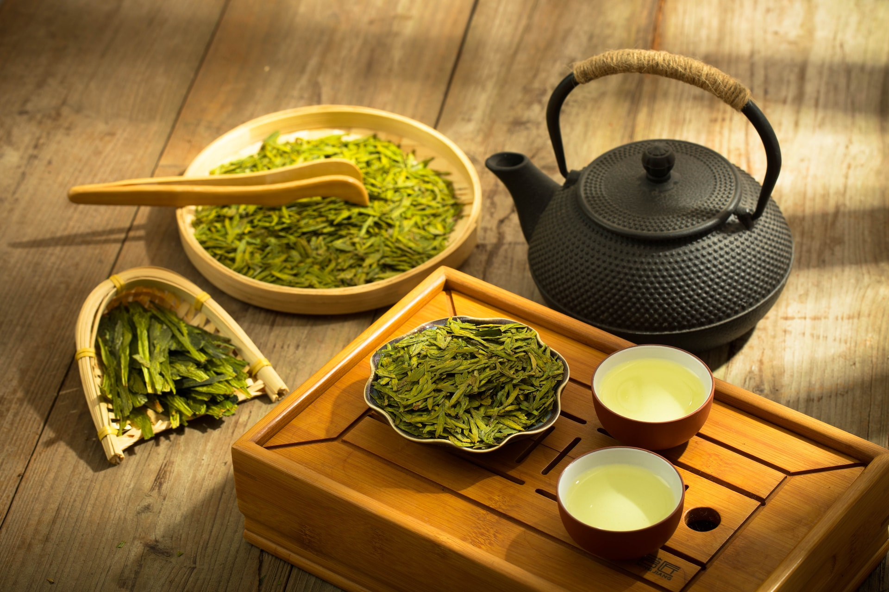

## Inhaltsverzeichnis

## Was du essen kannst, um dein Immunsystem so richtig in Gang zu bringen. 

## Ein starkes Immunsystem

Es ist dein Immunsystem, das darüber entscheidet, ob ein Erreger deine Gesundheit beeinträchtigen kann – oder eben nicht.  Ein starkes Immunsystem ist entscheidend, wenn du dich vor Krankheiten und gesundheitlichen Problemen schützen oder ihnen vorbeugen möchtest. Es wirkt wie ein Schutzschild, der deinen Körper gegen schädliche Krankheitserreger wie Bakterien, Viren und Parasiten verteidigt. Auf diese Weise kann es dein Risiko für Infektionen, Entzündungen und Krankheiten senken. Wenn deine körpereigene Abwehr stark ist, kannst du folglich putzmunter tun, was auch immer du gerne tust, ohne Einschränkungen.

## Verteidiger und Partner

Entsprechend nährstoffreiche Lebensmittel zu dir zu nehmen, die das Immunsystem erhalten und stärken, ist eine effektive Methode, wenn du dich gesundheitlich gut aufstellen willst. Denn dein Immunsystem ist dein wichtigster Verteidiger und Partner für eine stabile Gesundheit. Wenn es stark ist, kannst du den Stürmen des Wetters und des Lebens gut widerstehen.

Nun, was kannst du tun, um dich in diesem Sinne „wetterfest“ zu machen? Eine ganze Menge! Die gute Nachricht ist: Durch deine Ernährung kannst du die normale Funktion des Immunsystems optimal unterstützen. Als Erstes kannst du also die besten Lebensmittel in deinen Speiseplan einbauen, die deinem Immunsystem helfen und es unterstützen.

## Dein Immunsystem stärken

Als allgemeiner Leitfaden kann man sagen, es ist zunächst empfehlenswert, schädliche Stoffe zu meiden, die dein Immunsystem schwächen. Darüber hinaus kannst du vor allem die folgenden Lebensmittel in deine Ernährung aufzunehmen, um deine Abwehrkräfte optimal zu unterstützen und deinen Tagesbedarf und Vitaminen und Mineralstoffen abzudecken:

- zuckerarme Lebensmittel

- Kräuter mit hohem Phyto Nährstoffgehalt

- Obst und Gemüse, da sie wichtige sekundäre Pflanzenstoffe und Ballaststoffe für deine Darmgesundheit beinhalten

- fermentierte und probiotische Lebensmittel, wie zum Beispiel Sauerkraut, Kimchi und Kefir

- Nüsse, da sie viele Nährstoffe wie Vitamin E, Magnesium und Zink, Omega-3-Fettsäuren enthalten und oxidativen Stress abbauen

- gesunde Fette wie Olivenöl, Avocadoöl, Walnussöl, Leinöl, Ghee, Kokosöl

Unsere Nahrungsmittel sollten Heilmittel, unsere Heilmittel Nahrungsmittel sein.

Hippokrates von Kos

## 10 Lebensmittel

Hier findest du eine Liste der besten 10 Lebensmittel, die du auf deinen Speiseplan setzen solltest, um dein Immunsystem aufzubauen. Natürlich nur, wenn du gegen keine der genannten Nahrungsmittel allergisch bist.

Du solltest versuchen, alle diese Lebensmittel in deinen täglichen Speiseplan aufzunehmen, und 3 Portionen pro Tag anzustreben.

## 1\. Zitronen und Limetten 

Wenn es um die körperlichen Abwehrkräfte geht, denkt man meistens zuerst an Vitamin C. Vitamin C ist essenziell für deine Abwehrkraft, wehrt Infektionen ab und beugt Erkrankungen vor. Es trägt dazu bei, das Immunsystem zu stärken und es stark zu halten.

Zu den besten Vitamin-C-Quellen gehören Zitrusfrüchte wie Zitronen und Limetten, die sich leicht in die Ernährung integrieren lassen. Du kannst sie einfach in Säfte, Gerichte, Dressings, Dips oder Salate geben, um den Geschmack zu verbessern. Außerdem empfehle ich, Zitronen- oder Limettensaft ins Wasser zu geben, um **das Immunsystem zu stärken, zu entgiften und den Stoffwechsel anzukurbeln.**

## 2\. Knochenbrühe 

Zu den super Vorteilen von Knochenbrühe gehören ihr würziger Geschmack und ihr Nährwert, denn sie enthält super viele **Mineralien und Aminosäuren**. Sie wird durch das Kochen der Knochen und des Bindegewebes von Rindern, Hühnern, Wild oder sogar Fischen gewonnen.

Die Vorteile der Knochenbrühe ergeben sich aus dem Knochenmark, das die wesentlichen Bestandteile für die Produktion von robusten Blutzellen liefert. Das Knochenmark enthält wichtige Bestandteile wie Eisen, Zink und Kupfer, die für die Produktion von gesunden Blutzellen, einschließlich roter Blutkörperchen, notwendig sind. Rotes Knochenmark ist auch eine Quelle für Stammzellen, die die Produktion von verschiedenen Arten von Blutzellen unterstützen können. Durch den Verzehr von Knochenbrühe kann man diese Bestandteile aufnehmen, die möglicherweise zur Förderung einer gesunden Blutzellproduktion beitragen.

Daher ist Knochenbrühe für Menschen, die mit Entzündungen und immunologischen Problemen zu kämpfen haben, von großem Nutzen. Darüber hinaus **verbessert Knochenbrühe die Verdauung, fördert die Gesundheit der Gelenke und unterstützt möglicherweise sogar gesunden Schlaf**.

Es ist ganz einfach, Knochenbrühe in deine tägliche Routine einzubauen. Du kannst sie zu jedem Zeitpunkt des Tages zu dir nehmen oder sogar eine Mahlzeit damit ersetzen. Ich finde sie auch super für die Arbeit (einfach heißes Wasser dazu, fertig. Vielleicht noch blanchiertes Gemüse dazu - schnell, gesund und lecker).

Knochenbrühe lässt sich relativ einfach selbst zubereiten. [Hier](https://bonebrox.com/blogs/blog/knochenbruehe-zuhause-selber-herstellen) findest du ein passendes Rezept dafür. Oder du kannst fertige Knochenbrühe kaufen, wobei du auf Bio-Qualität achten solltest.

Meistens bereiten wir unsere Knochenbrühe selbst zu. Aber Knochenbrühe in sehr guter Qualität findest du zum Beispiel bei Jarmelo, die wir f**ür dich gesucht und getestet** haben.

### Unser Favorit

Wir werben für Partner und Produkte, von denen wir überzeugt sind und mit denen wir in der Praxis sehr gute Erfahrungen gemacht haben. Das bedeutet, diese entsprechen hohen Standards bezüglich Qualität, Preis-Leistungs-Verhältnis, therapeutisch wirksamer Dosierung, Reinheit und Nachhaltigkeit. Die Einnahmen, die wir durch manche der Empfehlungen erzielen, kommen dem Blog zugute. **#weildueswertbist**

Premium

Jarmino Knochenbrühe

Kollagen, Aminosäuren & Mineralstoffe dem Körper auf natürliche Weise zuführen.
Höchste Qualitäts-, Produktions- und Hygienestandards (GMP, ISO 9001, HACCP)

15 % Rabatt bei Erstbestellung

{/*  */}

## 3\. Pilze

Abgesehen davon, dass Pilze irre interessante **Lebewesen!** sind (darüber schreibe ich ein andermal) gibt es sie in den unterschiedlichsten Variationen und Arten.

In einigen Kulturen werden Pilze bereits **seit Jahrtausenden medizinisch eingesetzt** und haben zahlreiche gesundheitliche Vorteile für das Immunsystem.

Bestimmte Pilzarten gelten als Superfoods und sind aufgrund ihrer starken Wirkung auf die Gesundheit von großem Nutzen. Die östliche Medizin kennt und nutzt diese Heilpilze seit Jahrtausenden, insbesondere wegen ihrer immunstärkenden Eigenschaften und verschiedener anderer gesundheitlicher Vorteile, wie zum Beispiel, dass sie reich an Zink und Vitamin C sind. Hier ein Überblick über die Wirkung wichtiger Heilpilze.

- **Reishi** ist ein sehr gefragter Pilz, der den Schlaf, die Stimmung und das Immunsystem verbessern kann, Stress reduziert, die Lebergesundheit verbessert und die antivirale und antimikrobielle Eigenschaften hat.

- **Chaga** hat entzündungshemmende Eigenschaften, stärkt das Immunsystem, schützt vor oxidativem Stress, unterstützt die Entgiftung, wirkt positiv auf den Blutzuckerspiegel und den Cholesterinspiegel und wirkt antimikrobiell.

- **Schmetterlingstramete** ist vor allem für seine antioxidativen Eigenschaften und seine immunmodulierende Fähigkeit bekannt. Er zeigt auch entzündungshemmende Eigenschaften und wirkt potenziell krebsbekämpfend (hemmt das Wachstum von Krebszellen).

- **Löwenmähne, auch Igelstachelbart genannt**, stärkt ebenfalls das Immunsystem, unterstützt die Verdauung, deine Gehirnfunktion (Gedächtnis und Kognition) und wirkt neuroprotektiv (schützt Nervenzellen).

- **Cordyceps** ist eine gute Wahl, um das Energieniveau und die Ausdauer zu steigern, dein Immunsystem zu stützen und den Stressabbau zu fördern.

In der Anwendung kommen sowohl das Pilzpulver als auch der Pilzextrakt zum Einsatz.

- **Pilzpulver**: hier wird der getrocknete Pilz zu Pulver gemahlen und es enthält die gesamten Bestandteile des Pilzes (also auch Nährstoffe und Fasern).

- **Pilzextrakt** wird aus dem Pilzpulver gewonnen, indem man es mit Wasser oder Alkohol extrahiert. Das führt zur Konzentration der Wirkstoffe gegenüber dem Pulver.

Du solltest allerdings auf Bio-Qualität achten, denn ansonsten können die Pilze auch Stoffe enthalten, die für deine Gesundheit alles andere als zuträglich sind.

Es ist ganz einfach, diese Pilze in deine tägliche Routine einzubauen. Du kannst sie zum Beispiel in deinen morgendlichen Smoothie, eine Tasse Kaffee oder ein Pfannengericht geben. Am einfachsten sind sie als fertiges Pilzpulver oder -extrakt zu erwerben.

### Unser Favorit

Wir werben für Partner und Produkte, von denen wir überzeugt sind und mit denen wir in der Praxis sehr gute Erfahrungen gemacht haben. Das bedeutet, diese entsprechen hohen Standards bezüglich Qualität, Preis-Leistungs-Verhältnis, therapeutisch wirksamer Dosierung, Reinheit und Nachhaltigkeit. Die Einnahmen, die wir durch manche der Empfehlungen erzielen, kommen dem Blog zugute. **#weildueswertbist**

Premium

Mico Five Bio-Extrakt aus 5 Vitalpilzen

Power Mischung von Reishi, Chaga, Maitake, Shitake & Sonnenpilz für dein Immunsystem. Natürliches Nahrungsergänzungsmittel ohne GVO (gentechnisch veränderte Organismen). Ohne Gluten, Lactose oder tierische Bestandteile, vegan. 100% Bio-Qualität!

{/*  */}

## 4\. Knoblauch und Zwiebeln

Knoblauch und Zwiebeln sind eng miteinander verwandt und bieten ähnliche Vorteile. Sie werden seit Jahrhunderten zur Bekämpfung von Infektionen eingesetzt und haben sehr potente Eigenschaften, die Entzündungen wirksam reduzieren und ein gesundes Immunsystem fördern. Unter anderem wirken sie:

- antimikrobiell (gegen Bakterien, Viren und Pilze) durch das enthaltene Allicin

- positiv auf den Blutdruck und den Cholesterinspiegel und stärken so die Herz-Kreislauf-Gesundheit

- Immunstärkend, u. a. zur Vorbeugung von Erkältungen und anderen Infektionen

- Antioxidativ

Knoblauch und Zwiebeln lassen sich leicht in viele Rezepte einbinden, roh oder gekocht. Sie können Salate, Pfannengerichte, gebackenes Gemüse, Fleischgerichte, Dips, Dressings, Soßen und Suppen geschmacklich aufwerten, indem Sie sie verwenden. Oder auch mal Spaghetti Alio e Olio (am besten low carb)…… Mmmh.

## 5\. Olivenöl

Öle sind ein Grundnahrungsmittel in der mediterranen Küche, von der man weiß, dass sie viele gesundheitliche Vorteile hat. Olivenöl ist **reich an einfach ungesättigten Fetten.** Es ist reich an Polyphenolen, also Antioxidantien (die freie Radikale neutralisieren), hat starke entzündungshemmende Eigenschaften und trägt zur Erhaltung eines starken Immunsystems bei. Studien deuten darauf hin, dass die Aufnahme von Olivenöl in die Ernährung die Gesundheit des Immunsystems verbessert, die Wahrscheinlichkeit von Infektionen verringert und vor Entzündungen schützen kann.

Die Verwendung von rohem Olivenöl ist ausgezeichnet. Es verleiht Salatdressings oder Soßen zum Dippen einen herrlichen Duft und Geschmack. Nur **bitte nicht stark erhitzen, denn dann entstehen Transfettsäuren, die ungesund sind.** Deshalb solltest du zum Braten oder bei hoher Hitze lieber andere gesunde Fette wie Kokosfett, Avocadoöl, Erdnussöl oder Ghee einsetzen.

## 6\. Apfelessig

Apfelessig ist eine Essigsorte, die durch Fermentation von Apfelmost hergestellt wird. Er kann vielfältig eingesetzt werden, sowohl innerlich als auch äußerlich, um die Gesundheit zu verbessern und als natürliches Reinigungs- oder Schönheitsmittel.

Er enthält große Mengen an **Vitamin C, Vitamin E und Antioxidantien und wirkt probiotisch**, d.h. er fördert deine Darmgesundheit wie eine Reihe anderer fermentierter Lebensmittel auch. Studien haben gezeigt, **dass er die Funktion des Immunsystems stärkt und Verstopfung, Grippe und Erkältungssymptome lindern** kann.

Du kannst zum Beispiel zu deinem Wasser etwas Apfelessig hinzufügen. Wenn du unter saurem Reflux leidest, kannst du versuchen, morgens eine Mischung aus Apfelessig und Wasser zu trinken. Um Erkältungen zu bekämpfen, kannst du einen Teil Apfelessig mit fünf bis sechs Teilen Wasser mischen und noch 2 bis 3 Esslöffel biologischen, rohen Honig dazugeben.

## 7\. Ingwer 

Ingwer wird in Asien schon **seit über zwei Jahrtausenden aufgrund seiner heilenden Eigenschaften verwendet** und hat sich zwischenzeitlich weltweit als natürliches Heilmittel und schmackhaftes Gewürz verbreitet.

Wissenschaftliche Studien deuten darauf hin, dass Ingwer starke **antioxidative und entzündungs-hemmende Eigenschaften** besitzt, die zur Verringerung von Entzündungen beitragen und das Risiko langfristiger Gesundheitsprobleme senken. Er kann helfen, **Entzündungen zu verringern, das körpereigene Immunsystem zu stärken, Halsschmerzen zu lindern und die Verdauung zu verbessern**. Es gibt sogar eine neue Studie (2022) zu Ingwer in Kombination mit Zitrone, die bei Mäusen zu einer Tumorreduktion geführt haben.

Du kannst Ingwer roh oder gemahlen einsetzen. Er schmeckt super in Suppen, Currys, Gemüse, Salaten und Desserts. Du kannst ihn auch ganz einfach in grüne Säfte und Smoothies geben.

## Ingwer Tee

Einfach 2 Esslöffel Ingwer in 300-500 ml Wasser 10-15 Minuten lang kochen und einen Esslöffel Zitronensaft hinzufügen. Dann zurücklehnen und genießen.

## 8\. Beeren

Beeren wie Blau-, Brom-, Him-, Erdbeeren und Cranberries sind reich an wichtigen Vitaminen, Mineralstoffen und Polyphenolen. Die auffälligsten Polyphenole in Beeren sind Anthocyane, die ihnen ihre charakteristische Farbe verleihen. Anthocyane haben nachweislich eine **antioxidative, antikarzinogene und entzündungshemmende biologische Wirkung**.

Neben Anthocyanen enthalten Beeren reichlich **sekundäre Pflanzenstoffe** wie Ellagsäure und die Flavonoide Catechin, Quercetin und Kaempferol. Diese Verbindungen wirken ebenfallsantioxidativ, krebshemmend und entzündungshemmend.

## 9\. Kreuzblütler-Gemüse 

Kreuzblütler oder Brassica-Gemüse gehören zu den nahrhaftesten Lebensmitteln, die man essen kann. Sie bieten eine Reihe von Vitaminen und Mineralien und sind reich an Phytonährstoffen, Carotinoiden und Flavonoiden. Diese Verbindungen bekämpfen Schäden durch freie Radikale und tragen zur Neutralisierung von Giftstoffen im Körper bei.

Kreuzblütler enthalten Glucosinolate, die die Produktion von Enzymen steigern. Glucosinolate sind schwefelhaltige Verbindungen, die in Metaboliten aufgespalten werden. Die Metaboliten lösen spezifische enzymatische Reaktionen aus, die zur Entgiftung der Leber beitragen und deren Fähigkeit erhöhen, Karzinogene und Schwermetalle aus dem Blut zu entfernen. Außerdem unterstützen sie die den Darm und die Verdauung.

Zu den Kreuzblütlern gehören Rosenkohl, Brokkoli, Blumenkohl, Grünkohl und Blattsenf. Sie haben einen charakteristischen bitteren Geschmack und einen scharfen Geruch.

Brokkoli ist ein leistungsstarkes Kreuzblütler-Gemüse, das eine fantastische Quelle für **Sulforaphan** ist. Sulforaphan ist ein wirkungsvolles Isothiocyanat (ITC), das die Replikation (Vervielfältigung) von Krebszellen reduziert und das Immunsystem stärkt.

Siehe auch: [Therapeuten Tipp in "Superfoods Reloaded" zu Sulforaphan](https://gesundheit-in-tuebingen.de/8-superfoods-reloaded/).

## 10\. Grüner Tee 

Grüner Tee ist bekannt für seine zahlreichen gesundheitlichen Vorteile, auch in Bezug auf deine Abwehrkräfte bis auf die Ebene der Zellen. Untersuchungen haben gezeigt, dass grüner Tee eine Vielzahl von Verbindungen enthält, die sich positiv auf deine Gesundheit auswirken können.

Studien ergaben, - die neuesten von 2022 - dass die in grünem Tee enthaltenen Katechine eine **immunmodulatorische Wirkung** haben können. Das heißt, dass sie dein Immunsystem regulieren können. Diese Katechine haben antioxidative und entzündungshemmende Eigenschaften, die dazu beitragen können, **Entzündungen im Körper zu reduzieren** und deine stabile Gesundheit zu fördern.

Darüber hinaus wurde festgestellt, dass grüner Tee reich an Epigallocatechingallat (EGCG) ist, einer **Verbindung mit starken immunstärkenden Eigenschaften**. Ergebnisse deuten darauf hin, dass EGCG die Aktivität bestimmter Immunzellen erhöhen kann, was zu einer verbesserten Abwehrreaktion des Körpers führt. Grüner Tee besitzt sogar antivirale Eigenschaften und kann das Risiko für virale Infektionen verringern.

Wenn du jetzt Lust bekommen hast, noch mehr für deine Abwehrkräfte zu tun, dann lies auch unseren entsprechenden [Artikel](https://gesundheit-in-tuebingen.de/mikronaehrstoffe-immunsystem-booster/). Hier geht es um die **wichtigsten Mikronährstoffe wie Vitamin D, Vitamin C, Zink, Vitamin A und andere,** **die deinen Körper zusätzlich optimal unterstützen.**

Wenn du diese Nahrungsmittel regelmäßig auf deine Einkaufsliste setzt und sie verzehrst, kannst du dein Immunsystem boosten. Also such dir aus, welche davon dich am meisten ansprechen und los gehts. **#sogehtgesund**

Quellen:

- Ware, M. How can lemons benefit your health. Medical News Today. https://www.medicalnewstoday.com/articles/28347

- Kawai, Nobuhiro, et al. ["The sleep-promoting and hypothermic effects of glycine are mediated by NMDA receptors in the suprachiasmatic nucleus."](https://pubmed.ncbi.nlm.nih.gov/25533534/) Neuropsychopharmacology 40.6 (2015): 1405-1416

- Stsiapanava, Alena, et al. "[Binding of Pro-Gly-Pro at the active site of leukotriene A4 hydrolase/aminopeptidase and development of an epoxide hydrolase selective inhibitor."](https://www.researchgate.net/publication/260486369_Binding_of_Pro-Gly-Pro_at_the_active_site_of_leukotriene_A4_hydrolaseaminopeptidase_and_development_of_an_epoxide_hydrolase_selective_inhibitor) Proceedings of the National Academy of Sciences 111.11 (2014): 4227-4232

- Friedman, Mendel. ["Chemistry, nutrition, and health-promoting properties of Hericium erinaceus (Lion’s Mane) mushroom fruiting bodies and mycelia and their bioactive compounds."](https://pubmed.ncbi.nlm.nih.gov/26244378/) Journal of Agricultural and Food Chemistry 63.32 (2015): 7108-7123

- Diling, Chen, et al. ["Immunomodulatory activities of a fungal protein extracted from Hericium erinaceus through regulating the gut microbiota."](https://pubmed.ncbi.nlm.nih.gov/28713364/) Frontiers in Immunology 8 (2017): 666.

- [https://hifasdaterra.com/en/blog/the-best-mushrooms-to-support-your-immune-system/](https://hifasdaterra.com/en/blog/the-best-mushrooms-to-support-your-immune-system/)

- Arreola, Rodrigo, et al. "[Immunomodulation and anti-inflammatory effects of garlic compounds."](https://pubmed.ncbi.nlm.nih.gov/28713364/) Journal of immunology research 2015 (2015).

- Bayan, Leyla, Peir Hossain Koulivand, and Ali Gorji. ["Garlic: a review of potential therapeutic effects."](https://pubmed.ncbi.nlm.nih.gov/28713364/) Avicenna journal of phytomedicine 4.1 (2014): 1.

- Ghosh, Tarini Shankar, et al. «Mediterranean diet intervention alters the gut microbiome in older people reducing frailty and improving health status: the NU-AGE 1‑year dietary intervention across five European countries.» Gut 69.7 (2020): 1218–1228.

- Puertollano, Ma A., et al. ["Olive oil, immune system and infection."](https://pubmed.ncbi.nlm.nih.gov/20204249/) Nutricion Hospitalaria 25.1 (2010): 1-8.

- https://www.webmd.com/diet/apple-cider-vinegar-and-your-health

- Yan, Fang, and D. B. Polk. ["Probiotics and immune health."](https://journals.lww.com/co-gastroenterology/pages/articleviewer.aspx?year=2011&issue=11000&article=00003&type=abstract) Current opinion in gastroenterology 27.6 (2011): 496.

- Mashhadi, Nafiseh Shokri, et al. ["Anti-oxidative and anti-inflammatory effects of ginger in health and physical activity: review of current evidence."](https://www.ncbi.nlm.nih.gov/pmc/articles/PMC3665023/) International journal of preventive medicine 4.Suppl 1 (2013): S36.

- Ballester, Pura, et al. ["Effect of ginger on inflammatory diseases."](https://pubmed.ncbi.nlm.nih.gov/36364048/) Molecules 27.21 (2022): 7223.

- Al-Ataby, Israa A., and Wamidh H. Talib. ["Daily consumption of lemon and ginger herbal infusion caused tumor regression and activation of the immune system in a mouse model of breast cancer."](https://pubmed.ncbi.nlm.nih.gov/35495945/) Frontiers in Nutrition 9 (2022): 829101.

- Hannum SM, Potential impact of strawberries on human health: a review of the science. 2004: 44(1): 1-17. PMID: 15077879 https://pubmed.ncbi.nlm.nih.gov/15077879/

- Joseph, Shama V., Indika Edirisinghe, and Britt M. Burton-Freeman. ["Berries: anti-inflammatory effects in humans."](https://pubmed.ncbi.nlm.nih.gov/24512603/) Journal of agricultural and food chemistry 62.18 (2014): 3886-3903.

- Sturm C, Wagner AE, Brassica-Derived Plant Bioactives as Modulators of Chemopreventive and Inflammatory Signaling Pathways. 2017 Sep; 18(9). PMID: 28862664: [https://pubmed.ncbi.nlm.nih.gov/28862664/](https://pubmed.ncbi.nlm.nih.gov/28862664/)
