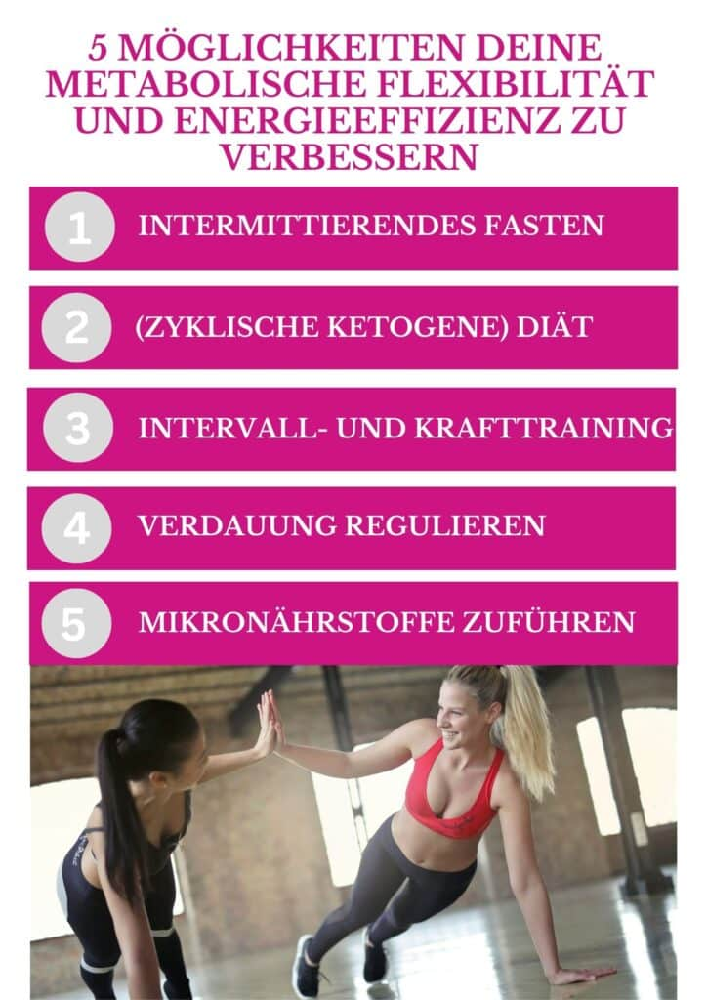
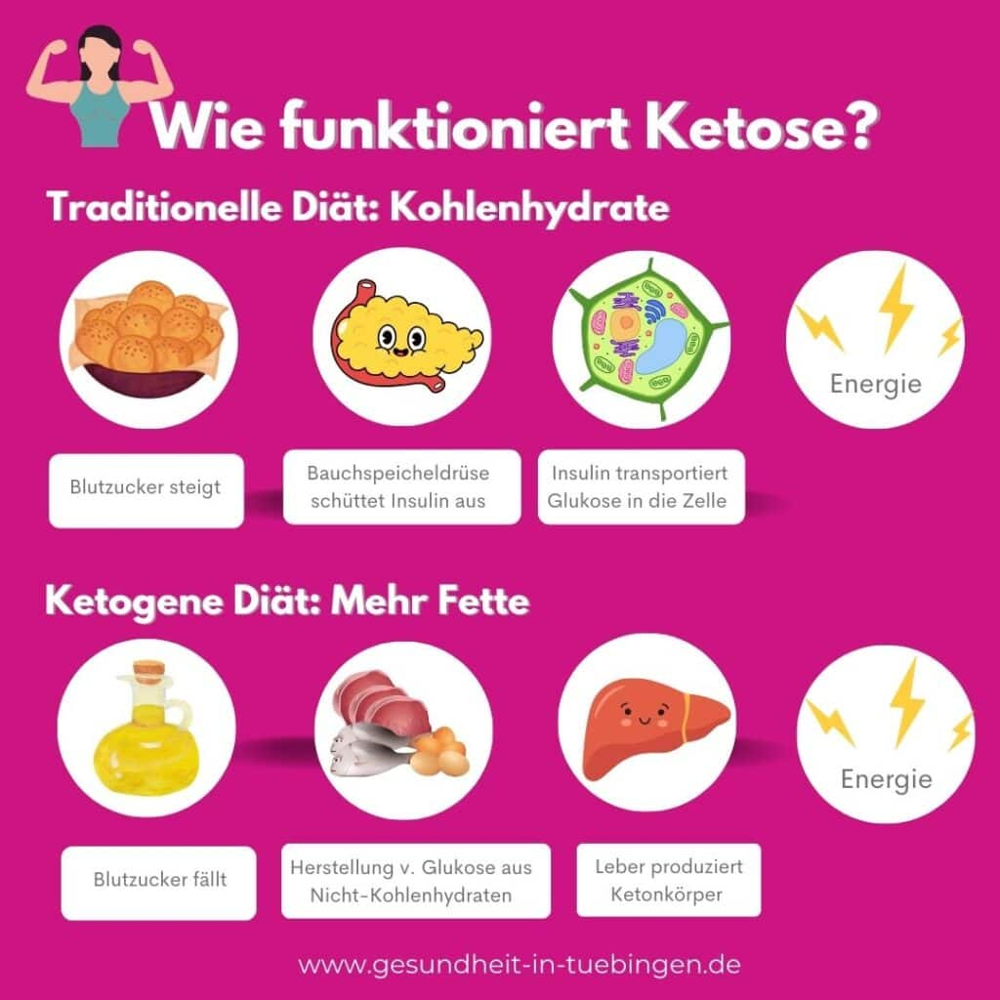
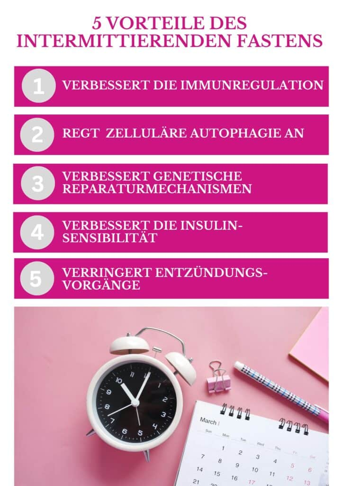

## Inhaltsverzeichnis

## Intermittierendes Fasten - wie es dir gelingen kann.

Würdest du etwas tun, was alle großen Weisen und spirituellen Führer in der Geschichte getan haben, das nichts kostet und das eine erhebliche Steigerung deiner allgemeinen Gesundheit und Vitalität bringt? Wenn deine Antwort ja ist, lies weiter und lerne, wie du die einfache Methode des intermittierenden Fastens für dich nutzen kannst.

Das Fasten wurde von all unseren Vorfahren unbewusst praktiziert, aufgrund von regelmäßigem Nahrungsmangel, und bewusst von vielen der intelligentesten und spirituell fortschrittlichsten Menschen weltweit praktiziert – bis heute. Diese Heilmethode kostet nichts außer etwas Disziplin und hat einen unglaublich verjüngenden Effekt auf dein Immunsystem und deine Zellen.

Hilfreich ist, sich von den gesellschaftlichen Konventionen zu lösen, die uns vorgeben, täglich drei Mahlzeiten und Zwischensnacks zu uns nehmen zu müssen. Wir müssen uns von dem Gedanken befreien, dass wir (ver-) hungern würden, wenn wir eine Mahlzeit auslassen, denn offen gesprochen ist das totaler Quatsch.

## Die Geschichte des Fastens

In der biblischen Zeit zum Beispiel war Fasten ein normaler Bestandteil des geistlichen Lebens. Jesus fastete 40 Tage lang, bevor er seinen Dienst begann. Viele der Propheten sprachen über das Fasten, und Gläubige wurden zum regelmäßigen Fasten aufgerufen. Das Fasten war gewissermaßen eine alltägliche Routine für das hebräische Volk.

Und bereits ca. 400 Jahre v. Chr. sagte Hippokrates, der Vater der modernen Medizin: „_Die Zufuhr von Nahrung sollte viel seltener stattfinden, da es oft nützlich ist, sie vollständig wegzulassen, solange der Patient dies ertragen kann, bis die Kraft der Krankheit ihren Höhepunkt erreicht hat. Der Mensch trägt einen Arzt in sich; man muss ihm nur dabei helfen, seine Arbeit zu verrichten. Ist der Körper nicht gereinigt, schadet man ihm umso mehr, je mehr man ihn ernährt. Wird ein Patient zu reichhaltig ernährt, nährt man damit auch die Krankheit. Jedes Übermaß ist wider die Natur._“

Der griechische Philosoph Platon sagte:

Ich faste für mehr körperliche und geistige Leistungsfähigkeit.

**Platon**

Er meinte damit, dass Fasten hilft, sowohl seine geistige als auch seine körperliche Energie effizienter zu nutzen. Die heutige Forschung zeigt, dass Platon damit richtig lag, denn Fasten verbessert sowohl unsere metabolische Flexibilität als auch unsere Energieeffizienz.

## Metabolische Flexibilität und Energieeffizienz

Was das Fasten angeht, solltest du einige grundlegende Begriffe verstehen. Die Schlüsselbegriffe sind metabolische Flexibilität und Energieeffizienz.

**Metabolische Flexibilität:**  Bezeichnet die Fähigkeit, unseren Stoffwechsel anzupassen, um den Anforderungen unserer Umgebung gerecht zu werden. Der Metabolismus ist dein Stoffwechsel, also die Gesamtheit aller chemischen Prozesse, die in deinem Körper stattfinden, um ihn am Leben zu erhalten.

**Energieeffizienz:**   Bezeichnet die Nutzung unserer Energie auf möglichst effiziente Weise, um alle Bedürfnisse des Körpers zu regulieren.

Wir müssen uns tagtäglich an eine Reihe von Umgebungen und Umstände anpassen. Archaisch gesehen waren wir gezwungen zu laufen, zu klettern, zu kämpfen, zu hungern und zu töten, um zu überleben. Unsere Vorfahren hatten nicht immer Zugang zu Nahrung und regelmäßiger Nahrungsmangel oder auch Hungersnöte waren weitverbreitet. Diese Herausforderungen stärkten unseren Körper und verschafften uns einen Überlebensvorteil durch die Fähigkeit, unseren Stoffwechsel an die spezifischen Anforderungen anzupassen.

In der heutigen Gesellschaft müssen wir das nicht mehr tun. Essen ist allgegenwärtig und im Überfluss verfügbar (wenn auch häufig in schlechter Qualität) und wir leiden viel eher an Bewegungsmangel, als dass wir unserem Abendessen über die Steppe hinterherjagen müssten. Dies führt zu einem Verlust an metabolischer Flexibilität und Energieeffizienz.

**Unsere gesellschaftlichen Veränderungen haben uns folglich ein hohes Maß an metabolischer Flexibilität und Energieeffizienz gekostet, was uns als Spezies schwächer macht und anfälliger für die Entwicklung chronischer Krankheiten.**

## Steigerung der metabolischen Flexibilität und Energieeffizienz

Jemand mit einer hohen metabolischen Flexibilität und Energieeffizienz ist in der Lage, augenblicklich eine hohe Kraft- und Schnelligkeitsleistung zur Bewältigung einer bestimmten Aufgabe zu erbringen. Damit einhergehen ein klares Denken, hohe Produktivität und Kreativität. Schließlich ist er auch in der Lage, problemlos mindestens 16 bis 18 Stunden ohne Nahrung auszukommen.

Es gibt verschiedene Methoden, um die metabolische Flexibilität und die Energieeffizienz zu steigern. Hier möchte ich dir fünf fundierte Ansätze vorstellen:

Alle diese Strategien helfen dabei, den Körper effizienter zu machen.

<figure>

<figcaption>

Foto von Bruce Mars auf Unsplash

</figcaption>

</figure>

## Ketogene Diät oder zyklische ketogene Diät

Bei einer ketogenen Ernährung wird die Zuckeraufnahme (=Glukose) eingeschränkt und die **Fähigkeit des Körpers unterstützt, eine alternative Energiequelle namens Ketone zu produzieren.** Ketone sind Abbauprodukte von Fettsäuren, die der Körper zur Erzeugung von zellulärer Energie in Form von Adenosintriphosphat (ATP) nutzt. Um Ketone produzieren und nutzen zu können, müssen wir unseren Verzehr von Lebensmittel einschränken, die sich in Glukose umwandeln. Das schließt sowohl Zucker und Stärke als auch hohe Mengen an Protein ein.

Ketone liefern eine große Menge an zellulärer Energie. Ferner erzeugt der Glukosestoffwechsel eine enorme Menge an Stoffwechselabfallstoffen und fördert Entzündungen im Vergleich zum Keton-Stoffwechsel. Dies macht die Ketone sozusagen zu einer „saubereren“ Energiequelle als den Glukosestoffwechsel.

**Wenn der Körper darauf trainiert ist, Ketone als Energiequelle zu nutzen, steigert das den Stoffwechsel und dein Körper wird energieeffizienter, d. h. er benötigt für dieselbe Leistung weniger Energie als vorher. Dann kann man längere Zeit ohne Nahrung auskommen und selbst in Zeiten von Nahrungsmangel die Muskelmasse erhalten.**

Wenn du fastest, baust du Fettreserven ab und dein Körper produziert Ketone. Diese Ketone stellen die Energie bereit, die du benötigst, um dich zu bewegen und die dein Körper benötigt, um alle lebensnotwendigen Aktivitäten auszuführen. Der Keton-Stoffwechsel unterstützt den Körper dabei, während des Fastens effektiver zu entgiften.

## Energieeinsparung 

In der Physik besagt das Energieerhaltungsgesetz, dass die Gesamtenergie eines abgeschlossenen Systems konstant bleibt und sie über die Zeit hinweg erhalten wird. Der menschliche Körper (obwohl er kein exakt abgeschlossenes System ist) verfügt jederzeit über eine bestimmte Menge an Energie, die er erzeugen kann. Das Geheimnis einer stabilen Gesundheit liegt darin, wie sinnvoll wir diese Energie verwenden.

Wir benötigen Energie für eine Reihe verschiedener Körpersysteme, einschließlich des Verdauungssystems, des Immunsystems, Gewebereparaturen, Bewegung, mentaler Konzentration usw. Wir verfügen über eine konstante Menge an Energie, um all diese Dinge zu tun.

Die Verdauung verbraucht sehr viel Energie, um die aufgenommene Nahrung zu zerlegen, zu verdauen und die Nährstoffe aufzunehmen. **Das Fasten erlaubt es uns, gespeicherte Nährstoffe zu verwenden, ohne den üblichen Energieaufwand der Verdauung, und fordert unseren Körper, effizienter mit den vorhandenen Ressourcen umzugehen.** Anders ausgedrückt, lebst du beim Fasten sozusagen von deinen Reserven und bist nicht darauf angewiesen, neue Nahrung aufzunehmen, deren Verdauung dich eben wieder Energie kosten würde. So wie ein elektrisches Gerät, das nicht am Strom hängt, sondern stattdessen auf Batterie läuft.

Wer stark, gesund und jung bleiben will, sei mäßig, übe den Körper, atme reine Luft und heile sein Weh eher durch Fasten als durch Medikamente.

**Hippokrates**

## 5 Vorteile des Intermittierenden Fastens

Eine gesunde Ernährung mit viel antientzündlichen Lebensmitteln führt zu deutlich weniger Entzündungen als eine ungesunde Ernährung, die zum Beispiel aus viel Fast Food, einfachen Kohlenhydraten oder auch [hochverarbeiteten Lebensmitteln](https://gesundheit-in-tuebingen.de/hochverarbeitete-lebensmittel-upfs/) besteht. Es ist jedoch wichtig zu verstehen, dass wir immer, wenn wir Nahrung zu uns nehmen, damit auch das Entzündungsniveau im Körper erhöhen, als Reaktion des Immunsystems auf zugeführte Substanzen. Je schwerer also eine Mahlzeit zu verdauen ist, desto mehr entzündliche Aktivität wird sie hervorrufen.

Um von einer Krankheit zu genesen, benötigt der Körper so viel Energie wie möglich, die er dann für die Unterstützung des Immunsystems und die Regeneration verwenden kann. Eine ganz natürliche Reaktion des Körpers ist es daher, dass du deinen Appetit verlierst, wenn du krank bist. Es ist ein cleverer, angeborener Mechanismus, um uns zum Fasten zu bringen. **Denn beim Fasten kann die ganze Energie, die normalerweise für die Verdauung verbraucht wird, dann für die Bekämpfung und Regulation der Krankheit eingesetzt werden. Und immerhin werden satte 30 Prozent der gesamten dir zur Verfügung stehenden Energie für die Verdauung verbraucht.**

<figure>

<figcaption>

Foto von Towfiqu Barbhuiya auf Unsplash

</figcaption>

</figure>

### 1\. Fasten verbessert die Immunregulation.

Als Konsequenz ermöglicht das Fasten dem Körper, mehr Energie für den Prozess der effektiven Regulation deines Immunsystems zu verwenden. Fasten bei gleichbleibender Wasserzufuhr spült auch das Verdauungssystem durch und verringert die Anzahl natürlicher Mikroorganismen im Darm. Die Anzahl der Mikroorganismen wird normalerweise durch das Immunsystem reguliert. Dadurch kann das Immunsystem seine Energie auf andere, wichtigere Bereiche lenken.

Intermittierendes Fasten ist ein hervorragender Regulator des Immunsystems, da es das Niveau der entzündungsfördernden Zytokine, die im Körper freigesetzt werden, kontrolliert. Zwei wichtige Zytokine, das Interleukin-6 und der Tumor-Nekrose-Faktor Alpha, fördern eine sehr starke entzündliche Reaktion im Körper. Studien haben gezeigt, dass Fasten die Freisetzung dieser entzündlichen Vermittlerstoffe reduziert. Die durch intermittierendes Fasten hervorgerufene Modulation des Immunsystems kann ebenfalls nützlich sein, wenn du unter mittelschweren bis schweren Allergien leidest.

### 2\. Fasten regt die zelluläre Autophagie an.

Fasten regt den Prozess der Autophagie an. Autophagie bedeutet, dass dein Körper alte, beschädigte oder entartete (z. B. Krebs-) Zellen abbaut, um sie zur Energiegewinnung zu recyceln. Der Prozess der Autophagie ist ein Bestandteil des angeborenen Immunsystems.

Intermittierendes Fasten regt also Autophagieprozesse an und dadurch werden virale Infektionen und die Vermehrung von intrazellulären Parasiten eingeschränkt (ja, Parasiten gibt es auch). Dieser Abbauprozess unterstützt den Körper dabei, sich von Krankheitserregern und entarteten Zellen zu befreien. Es ist ebenfalls bedeutsam für den Schutz des Gehirns und der Gewebezellen vor abnormalen Wucherungen, Toxizität und chronischer Entzündungen.

### 3\. Fasten verbessert die genetischen Reparaturmechanismen

Forschungen haben ergeben, dass Körperzellen während des Fastens oder Hungers eine längere Lebensdauer haben. Intermittierendes Fasten fördert die zelluläre Verjüngung, indem es auf bestimmte genetische Reparaturmechanismen einwirkt. Denn wir benötigen weniger Energie, um eine Zelle zu reparieren, als um sie zu teilen und neue Zellen zu schaffen.

Wenn wir also nichts oder wenig essen, verlangsamt der Körper die Zellteilung, um Energie zu sparen. Dies ist eine bedeutungsvolle Entdeckung, denn Krebszellen vervielfältigen sich durch rasche und unkontrollierte Zellteilung. Auf diese Weise kann Fasten den Mechanismus reduzieren, den Krebszellen nutzen, um unkontrolliert zu wachsen.

Das wichtigste Hormon, das diesen Prozess der Zellreparatur steuert, ist das Wachstumshormon Somatotropin (STH), auch Growth Hormon (GH) genannt. STH bewirkt Veränderungen in unserem Stoffwechsel, die die Fettverbrennung begünstigen und den Erhalt von Muskelgewebe unterstützen. Es signalisiert eine verstärkte Konzentration auf die Reparatur von Gewebe, bei der der Körper Aminosäuren und Enzyme verwendet, um das Gewebekollagen zu reparieren, was die Gesamtfunktion der Muskeln, Sehnen, Bänder und Knochen verbessert.

Forscher am _Intermountain Medical Center Heart Institute_ stellten fest, dass Männer, die 24 Stunden gefastet hatten, eine Steigerung des STH um 2000 Prozent verzeichneten. Bei den fastenden Frauen wurde ein Anstieg des STH um 1300 Prozent festgestellt. Die Forscher fanden heraus, dass sich bei den Fastenden ihre Triglyceride (Fette) deutlich verminderten, ihr HDL („gutes“ Cholesterin) signifikant anstieg und sich ihr Blutzuckerspiegel stabilisierte. (Anmerkung: Zu hohe Triglyzeridwerte im Blut können ein Risikofaktor für Herz-Kreislauf-Erkrankungen sein, v.a. in Kombination mit hohen HDL-Werten).

### 4\. Fasten verbessert die Insulinsensibilität

Insulin ist ein Hormon, das von der Bauchspeicheldrüse (Pankreas) ausgeschüttet wird, um die Zellen aufzuschließen, damit Zucker aus dem Blut in die Zelle gelangen kann. Das ist essenziell, da unser Blut wenig Toleranz für Schwankungen hat.  Insulin ermöglicht also gewissermaßen, dass Zucker (Glukose) in die Zellen „eingeschleust“ wird, wo er dann als Energiequelle verwendet oder zur späteren Verwendung gespeichert werden kann. Die Regulierung des Blutzuckerspiegels ist notwendig für den Körper, da sowohl zu hohe als auch zu niedrige Blutzuckerwerte gesundheitliche Probleme verursachen können.

Entstehungsgeschichtlich haben unsere Körper durch immer wiederkehrende Nahrungsknappheit einen Schutzmechanismus entwickelt, um sich an den Wechsel zwischen Nahrungsüberfluss und -mangel anzupassen. **In Folge werden unsere Zellmembranen in Zeiten der Nahrungsknappheit empfindlicher für Insulin.** Das stellt sicher, dass jedes bisschen Nahrung effizient genutzt oder gespeichert wird, was in Zeiten des Mangels überlebenswichtig sein kann.

**Herrscht Nahrungsüberfluss macht der Körper die Zellen gegenüber Insulin unempfindlicher, um die Belastung durch eine hohe Kalorienaufnahme zu vermeiden. Dies führt zu erhöhten Insulinspiegeln**, **höherer Fetteinlagerung sowie gesteigertem oxidativen Stress und entzündlichen Zuständen im Körper.**

STH und Insulin sind hormonelle Gegenspieler. Das bedeutet, dass sie auf entgegengesetzte Weise wirken.  **STH unterstützt die Reparatur von Gewebe, hilft bei der effizienten Nutzung von Energie und fördert entzündungshemmende Immunreaktionen.**

**Insulin regt die Energiespeicherung an, unterstützt die Zellteilung und fördert Entzündungsprozesse im Körper.**   Insulin ist dominanter als STH. Und wenn wir essen, vor allem Zucker und Stärke, und der Körper Insulin freisetzt, wird die Wirkung von STH gebremst.

Fasten hat sich als wirksam erwiesen, um die Insulinausschüttung zu verringern und die Insulinsensitivität zu verbessern. Dadurch kann der Körper also Insulin besser nutzen, sodass beim Essen weniger Insulin benötigt wird. Sinkt der Insulinbedarf, werden Entzündungen im Körper verringert und die STH Werte steigen.

Der Therapeuten Tipp!

Heutzutage herrscht bei uns gewissermaßen ein ständiges Überangebot an Essen.  Praktisch könnten wir zu jeder Zeit essen, wenn wir möchten. Tatsächlich empfehlen auch viele Gesundheitsberater, über den Tag verteilt 5 bis 6 kleine Mahlzeiten zu sich zu nehmen. Dieser Vorgang sendet jedoch dem Körper ein Signal des Überflusses, welches – siehe oben – **Fetteinlagerungen, Entzündungen im Körper und zu hohe Blutzuckerspiegel fördert und oxidativen Stress verursacht. Und oxidativer Stress ist Pro-Aging**, d. h. er lässt dich altern. Das häufige Essen hemmt auch die Ausschüttung wichtiger Hormone für die Gewebereparatur. Und diese Hormone besitzen eine starke Anti-Aging-Wirkung.
**Es lässt sich also wissenschaftlich fundiert sagen, dass es gesünder ist, das Essen auf wenige Mahlzeiten täglich zu konzentrieren und Snacks zu vermeiden.**

Sandra Pfeiffer
Heilpraktikerin, Systemische Therapeutin, Mediatorin & Traumatherapeutin

### 5\. Intermittierendes Fasten und chronische Krankheiten

Bei Menschen mit Autoimmunerkrankungen wie systemischem Lupus, Rheumatoider Arthritis, Colitis ulcerosa und Morbus Crohn hat sich gezeigt, dass durch intermittierendes Fasten eine enorme Verbesserung der Symptome erreicht werden kann. Es verringert die übermäßigen Entzündungsvorgänge, denen diese Personen ausgesetzt sind, und ermöglicht eine normalisierte Funktion des Immunsystems.

Und Krebszellen sind dafür bekannt, dass sie 10- bis 70-mal mehr Insulinrezeptoren als normale Zellen besitzen und auf den anaeroben Stoffwechsel von Zucker als Brennstoff angewiesen sind. Intermittierendes Fasten entzieht den Krebszellen die Nahrung und macht sie anfällig für Schäden durch freie Radikale, was letztlich zu ihrer Zerstörung führt.

Die Fastenlehre fordert uns auf, uns selbst zu kennen, uns zu beherrschen und uns zu disziplinieren, um uns besser befreien zu können. Fasten heißt, unsere Abhängigkeiten zu erkennen und uns von ihnen zu befreien.

Tariq Ramadan (schweizer Islamwissenschaftler)

## **Tipps für intermittierendes Fasten**

Beim intermittierenden Fasten verzichtest du zwischen 12 und 36 Stunden auf Nahrung. Du kannst es täglich oder auch phasenweise durchführen. Beim Fasten haben wir, was wir als unser Essensfenster und unser Fastenfenster bezeichnen.

**Essensfenster:**   Das ist die Zeitspanne zwischen deiner ersten und deiner letzten Mahlzeit.

**Fastenfenster:**   Das ist die Zeitspanne zwischen deiner letzten Mahlzeit des Tages und der ersten Mahlzeit am nächsten Tag.

**Ein Beispiel:**  Wenn du zwischen 12 Uhr mittags und 20 Uhr abends isst und anschließend bis 12 Uhr mittags am nächsten Tages fastest, dann hättest du ein achtstündiges Essensfenster und ein 16-stündiges Fastenfenster zur Reinigung.

Um dich dabei zu unterstützen, intermittierendes Fasten auf eine einfache Weise zu beginnen, schlage ich dir hier sieben Fastenstrategien vor. So kannst du diejenige für dich wählen, die dir am meisten zusagt. Oder du kannst mit einer einfachen anfangen, und dich später mit einem intensiveren Fasten herauszufordern.

**Ein konsistentes Muster beim intermittierenden Fasten zu haben, ist die beste Methode, um die metabolische Flexibilität und Energieeffizienz zu fördern.** Nach meiner eigenen Erfahrung ist es einfacher, beim regelmäßigen intermittierenden Fasten zu bleiben, als immer wieder hin und her zu springen zwischen Fasten und Nichtfasten. Am besten probierst du das für dich selbst aus, denn jeder ist anders und du kannst praktisch herausfinden, was für dich am einfachsten umsetzbar ist.

Wenn du noch nie gefastet hast, starte mit dem einfachen Fasten. Und am besten trinkst du gleich nach dem Aufwachen mindestens 250 bis 400 ml Wasser, um das morgendliche Hungergefühl zu verringern, das Fasten zu verlängern und den Reinigungsprozess zu verbessern.

## 7 Strategien für das intermittierende Fasten

### 1\. Einfaches Fasten

Ein einfaches Fasten, bei dem du für 12 Stunden zwischen Abendessen und Frühstück nur Wasser zu dir nimmst.

**Beispiel:**  Du beendest das Abendessen um 19 Uhr und isst erst um 7 Uhr morgens wieder.

Das ist ein guter Einstieg. Jeder (außer schwangeren Frauen und Säuglingen) sollte in der Lage sein, ein einfaches Fasten durchzuführen. Es ist ein erstes Ziel, um in eine regelmäßige Routine zu kommen. Das Einzige, was du dafür tun musst, ist, die Chips oder das Popcorn vor dem Fernseher wegzulassen🤪.

### 2\. Brunch Fasten 

Hierfür hältst du eine 14-stündige Fastenzeit zwischen dem Abendessen und dem Frühstück ein. Ich bezeichne das jetzt mal als Brunch-Fasten, weil du dein Frühstück einfach später als üblich einnimmst.

**Beispiel:**  Du beendest das Abendessen um 19 Uhr und isst erst wieder um 9 Uhr morgens.

### 3\. Skip Fasten

Zweimal pro Woche fastest du 16 Stunden lang, indem du entweder das Frühstück oder das Abendessen auslässt.  Die Fastentage sollten nicht hintereinanderliegen. Du könntest also z. B. am Montag und Freitag so fasten.

**Beispiel:**  Du beendest das Abendessen um 19 Uhr und isst am folgenden Tag erst zwischen 11 und 12 Uhr mittags wieder. Jede Woche wiederholst du das Fasten an denselben Tagen, also z. B. am Montag und Freitag.

### 4\. Zyklisches Fasten 

Du fastest dreimal pro Woche 16 Stunden lang, indem du entweder das Frühstück oder das Abendessen ausfallen lässt.

**Beispiel:** Du beendest dein Abendessen um 19 Uhr und das nächste Mal isst du zwischen 11 und 12 Uhr mittags am darauffolgenden Tag. Du wiederholst das dreimal wöchentlich, z. B. montags, mittwochs und freitags.

### 5\. Profi Fasten

Du nimmst alle Mahlzeiten innerhalb eines Zeitfensters von 6 bis 8 Stunden zu dir. Das bedeutet, du nimmst nur zwei Mahlzeiten täglich zu dir und lässt dauerhaft entweder das Frühstück oder das Abendessen aus.

**Beispiel:**  Du fastest morgens und nimmst täglich alle Mahlzeiten zwischen 12 und 19 Uhr oder zwischen 8 und 15 Uhr zu dir. Oder auch während eines beliebigen 6 bis 8 Stunden Fensters, das am besten in deinen Alltag passt.

### 6\. Krieger Fasten

Krieger marschierten oft den ganzen Tag und feierten abends. Sie konsumierten ihre gesamte Nahrung in einem täglichen Essensfenster von 3 bis 5 Stunden. Steckt ein Krieger:in in dir?

**Beispiel:** Du nimmst innerhalb eines 3- bis 5-stündigen Zeitfensters zwei Mahlzeiten zu dir, beispielsweise zwischen 14 und 18 Uhr oder zwischen 15 und 19 Uhr.

### 7\. Ein Fastentag pro Woche

Du konsumierst 24 Stunden nur Wasser oder Tee. Manche ergänzen das mit Knochen- oder Gemüsebrühe, die wertvolle Aminosäuren und Mineralstoffe liefern.

Du könntest auch grüne Säfte zubereiten, solange sie keine Früchte außer Zitronen oder Limetten enthalten, die sehr wenige Kohlenhydrate haben. Du könntest etwa einen Smoothie aus Zitrone, Sellerie, Gurke, Grünkohl, Petersilie und Ingwerwurzel machen, um Nährstoffe in den Körper zu bringen und die Vorteile des Fastens trotzdem beizubehalten.

Längeres Fasten, für mehr als 24 Stunden, bezeichnet man auch als Blockfasten. Dabei fastest du 1 bis 3 Tage oder auch länger. Manche fasten jeden Monat 4 bis 5 Tage lang und nehmen nur Flüssigkeiten zu sich. Das kann therapeutisch sein, gilt jedoch nicht als intermittierendes Fasten und liegt daher außerhalb des Schwerpunkts dieses Artikels.

Das Fasten ist das erste Gebot der Medizin. Faste und siehe die Kraft des Geists sich entfalten.

**Rumi**

## Herausforderungen beim intermittierenden Fasten

Die meisten Menschen werden sich wesentlich wohler fühlen, wenn sie Stärke und Zucker reduzieren und mehr gesunde Fette wie Kokosöl, Olivenöl und Avocados in ihre Ernährung einbauen. Die gesunden Fette helfen dabei, den Blutzuckerspiegel stabil zu halten, damit das Fasten leichter fällt. Wenn du mit dem Fasten beginnst, ist es wichtig sicherzustellen, dass dein Blutzuckerspiegel stabil ist, und während der Reinigungsphase solltest du darauf achten, ausreichend Wasser zu trinken.

Am besten trinkst du gleich morgens eine ordentliche Menge Wasser. Das gibt Energie, stillt deinen Hunger und unterstützt deine Verdauung, damit du deinen Darm mehrmals entleeren kannst, um die Stoffwechselendprodukte loszuwerden, also sozusagen deinen „Müll“ zu entsorgen.

Hier sind einige Herausforderungen, die bei längeren Fastenzeiten auftreten könnten.

- **HPA-Achsen-Dysfunktion** **oder Nebennierenmüdigkeit**
  Wenn eine Funktionsstörung der Hypothalamus-Hypophysen-Nebennierenrinden-Achse (auch Nebennierenerschöpfung genannt) vorhanden ist, können die Betroffenen keine ausreichende Menge an Stresshormone produzieren, und sich deshalb während des Fastens müde und entzündet fühlen.
  Wenn du davon betroffen bist, solltest du deinen Fokus auf eine ausreichende Wasserzufuhr und den Elektrolythaushalt legen. Zudem ist es hilfreich, dass du Atemübungen zur Vertiefung deiner Atmung praktizierst, deinen Körper durch Barfußgehen erdest und insgesamt für einen niedrigen Stresslevel sorgst. In diesem Fall ist es ratsam, zunächst mit einem einfachen Fasten von 12 Stunden zu beginnen, dabei viel Wasser trinken, zusätzliche Mineralien und Elektrolyte zu verwenden und darauf hinzuarbeiten, den Stresspegel während der Fastenzeit  so niedrig wie möglich zu halten. Sollten Probleme auftreten, dann sprich dich mit deinem Arzt oder Therapeuten ab.

- **Verstopfung**
  Wenn die Darmentleerung ausbleibt, kann sich im Körper ein toxischer Rückstau bilden, der zu einer verstärkten Stressreaktion führt. Dies kann einerseits zu einer Funktionsstörung der Hypothalamus-Hypophysen-Nebennieren-Achse (HPA-Achse) führen oder andererseits auch eine Folge davon sein. Betroffene sollten besonders auf eine ausreichende Zufuhr von Magnesium und eine gute Wasserzufuhr achten.
  Wenn du unter Verstopfung leidest, solltest du mehr als 30-40 ml Wasser pro Kilogramm Körpergewicht trinken und ungefähr einen halben Teelöffel (2,5 - 3 Gramm) Himalaya Salz auf 4 Liter Wasser geben. Ich empfehle auch, ausreichend Ballaststoffe zu essen. Ballaststoffe wie Leinsamen, Flohsamenschalen und Chia-samen (alle ausreichend einweichen!) , L-Glutamin, Kräutertees und Aloe Vera unterstützen dich dabei, in Schwung zu kommen.

## **Hilfreiche Tipps** 

Hier sind einige wichtige Anwendungstipps, die dir helfen können, um erfolgreich intermittierendes Fasten durchzuführen.

1.  **Wasserzufuhr:**  Trinke so viel sauberes Wasser (d. h. gefiltertes Wasser) und Kräutertees wie möglich. Die Flüssigkeitsaufnahme hilft dabei, Stresshormone zu senken und deinen Darm anzuregen. Wie bereits erwähnt, hilft das Trinken von 200 bis 400 ml Wasser direkt nach dem Aufstehen. Und regelmäßiges Trinken hilft, den Hunger zu verringern und die Nebennieren anzuregen. Achte auch darauf, dass deine Verdauung ordnungsgemäß funktioniert.

2.  **Mineralien:**  Wir benötigen Mineralien, um elektrochemische Energie zu erzeugen, und um Nebennierenhormone herzustellen. Wenn wir fasten oder uns kohlenhydratarm ernähren, scheiden wir tatsächlich Natrium aus, daher ist es unerlässlich, dies zu ersetzen. Ich empfehle daher, während der Entgiftungsphase deinem Wasser etwas Himalaja Salz hinzuzufügen, oder Bio-Brühe zu trinken, um die ausreichende Zufuhr von Mineralien zu gewährleisten.

3.  **Ergänzung von Magnesium:**  Der Körper benötigt Magnesium ungefähr so dringend, wie dein Auto Öl braucht. Wir benötigen Magnesium für über 300 lebenswichtige Funktionen. Magnesium ist zudem essenziell, um die Nebennieren zu beruhigen und die Darmbeweglichkeit (Motilität) zu verbessern. Die Verwendung eines guten Präparates mit **Magnesiumcitrat, -glycinat, -malat oder -threona**t kann dazu beitragen, dass man sich während einer Fastenphase wesentlich besser fühlt.

4.  **Probiotika:** Die Einnahme von Probiotika kann dazu beitragen, den Tonus des Darms zu verbessern und entzündliche Reaktionen im Darm zu verringern, welche die Nebennieren aktivieren könnten. **Vergiss nicht, dass 70 bis 80 Prozent deines Immunsystems im Darm liegen**. Ist also dein Darm nicht in Ordnung, ist dein Immunsystem geschwächt und du wirst anfälliger für Erkrankungen.

## Unsere Favoriten\*

Wir werben für Partner und Produkte, von denen wir überzeugt sind und mit denen wir in der Praxis ausgezeichnete Erfahrungen gemacht haben. Das bedeutet, diese entsprechen hohen Standards bezüglich Qualität, Preis-Leistungs-Verhältnis, therapeutisch wirksamer Dosierung, Reinheit und Nachhaltigkeit. Die Einnahmen, die wir durch manche der Empfehlungen erzielen, kommen dem Blog zugute. **#weildueswertbist**

- [BASIS: Darm-in-form Flora](/werbung/formmed-darm-in-form-flora)

- 13 Milliarden Keime aus drei Bakterienstämmen und der Hefe *S. boulardii*

- Hypoallergen, vegan, gluten-, laktose-, fruktosefrei mit GBA Qualitätssiegel

- **10 % Rabatt bei Angabe des Therapeuten (Sandra Pfeiffer**)

- [PREMIUM: MakroAktiv](/werbung/natugena-makroaktiv)

- 6 nicht-histamin-bildende Bakterienstämme

- Mindestens 44 Milliarden Kulturen pro Tagesdosis, inklusive Bio Colostrum, Vitamin D und A

- Reinsubstanzen-Prinzip: Frei von GMO, Hilfs-, Farb-, Konservierungsstoffe, Gluten, Lactose, Aromen, Soja. Basiert auf neuestem Stand der Wissenschaft

- **10 € Rabatt mit Gutschein 2571**

### Knochenbrühe

Fasten mit Knochenbrühe ist besonders beliebt und eine wirksame Methode, um viele der Vorteile des Fastens zu erzielen. Echte Knochenbrühe in Bioqualität liefert **Kollagenprotein, Gelatine, Prolin, Glycin, Chondroitinsulfat, Glykosaminoglykane, Hyaluronsäure**, und diese Stoffe tragen alle zur Heilung des Darms bei und verbessern die Festigkeit und Integrität der Gelenke. Zusätzlich liefert Knochenbrühe wichtige Mineralien wie **Kalzium, Phosphor, Magnesium und Kalium**, die bei der Energieproduktion, Entgiftung und den Heilungsprozessen im Körper unterstützen.

Das Fasten mit Knochenbrühe ist fantastisch für Personen, die **Autoimmunerkrankunge**n haben. Eine Ernährung, die ein potenzielles **Leaky-Gut-Syndrom** (durchlässiger Darm aufgrund einer undichten Darmschleimhaut) adressiert, entlastet das Verdauungssystem und versorgt es mit wichtigen Nährstoffen, die dazu beitragen, die Darmschleimhaut zu heilen. Zudem kann Knochenbrühe dabei helfen, während einer Fastenperiode den Muskelabbau zu verringern, da sie wesentliche Aminosäuren liefert, die den Muskelaufbau unterstützen und die Erhaltung der fettfreien Körpermasse fördern.

Knochenbrühe zu dir zu nehmen erleichtert das Fasten, da du dann weniger Hunger und Gelüste verspürst. Es ist ein großartiger Weg, um mit dem Fasten zu beginnen, wenn es neu für dich ist oder wenn du Probleme mit dem Energiehaushalt hast oder eine Nebennierenschwäche.

#### Unser Favorit\*

- [Jarmino Bio-Knochenbrühe](/werbung/jarmino-knochenbruehe)

- Kollagen, Aminosäuren & Mineralstoffe dem Körper auf natürliche Weise zuführen.

- Höchste Qualitäts-, Produktions- und Hygienestandards (GMP, ISO 9001, HACCP)

- 1 Tropfen deckt den Tagesbedarf.

- **15 % Rabatt mit Gutschein** **krenner**

### Bulletproof-Kaffee oder -Tee

Vor allem Proteine und Kohlenhydrate können die positiven Effekte des intermittierenden Fastens zunichtemachen. Es sind nämlich Proteine und Kohlenhydrate, die Insulin stimulieren und den Autophagieprozess stoppen. Daher wird es immer beliebter, während des Essensfensters gesunde Fette zu sich zu nehmen, wie Kokosöl, Weidebutter, Schlagsahne oder Ghee. Alle diese Fette sind frei von Aminosäuren. Sie fördern die Bildung von Ketonkörpern, die das Hungergefühl und die Gelüste reduzieren und sowohl das Gehirn als auch den Körper mit Energie versorgen.

Weil diese Fette so sättigend sind, kannst du sie beim intermittierenden Fasten zur Unterstützung in deinen Speiseplan einbauen. Man kann sie auch zu biologischem Kaffee oder Tee hinzufügen und so einen „Bulletproof-Kaffee“ oder „Bulletproof-Tee“ zubereiten. Das kann dir hauptsächlich dann hilfreich sein, wenn es dir zu Beginn schwerfällt, längere Phasen durchzuhalten, während derer du nicht isst und etwa ein leichtes Magenknurren bekommst (das ist primär der Fall, wenn du gewöhnt bist, viele zucker- oder stärkehaltige Lebensmittel zu essen).

Bulletproof-Kaffee oder -Tee machst du so:

- Mache 1 Tasse (etwa 250 ml) heiß gebrühten Kaffee oder Schwarztee

- Gib 2 Teelöffel oder 1 Esslöffel ungesalzene Butter, vorzugsweise Weidebutter dazu

- Gib 2 Teelöffel oder 1 Esslöffel biologisches Kokosöl dazu

- Mixe alles für etwa 20 bis 30 Sekunden auf hoher Stufe, bis das Getränk hell und schaumig ist

Das klingt vielleicht etwas wild, schmeckt aber wirklich sehr lecker. Ich selbst habe es auch einige Wochen getrunken, um ins intermittierende Fasten hereinzukommen (das wir regelmäßig praktizieren) und es war mir sehr hilfreich, mein Fastenfenster ausdehnen zu können. In der Regel nehmen Kai und ich heutzutage nur zwei Mahlzeiten zu uns, innerhalb eines Essensfensters von 8 Stunden. Und das hält man einwandfrei aus, bei gleichbleibender, hoher Energie. Das bedeutet, wir haben auch keine Schlappheitsanfälle, die sonst nach dem Essen (hauptsächlich kohlenhydratlastiger) Mahlzeiten bei vielen Menschen üblich sind. Und wenn es einmal in der Praxis heiß hergeht, fällt es uns auch gar nicht schwer, längere Zeitfenster der Nahrungskarenz auszuhalten.

### **Wer nicht fasten sollte** 

Es gibt einige Bevölkerungsgruppen, für die das Fasten nicht geeignet ist, wie schwangere Frauen. Auch Neugeborene sollten natürlich nicht fasten. Bis zu einem Alter von 6 bis 8 Monaten entwickeln sich Babys schnell und ihre Körper benötigen mehr Kalorien als ihre kleinen Mägen während eines zwölfstündigen Fütterungsfensters aufnehmen können. Nach etwa 8 bis 9 Monaten schläft das Kind normalerweise ungefähr 12 Stunden über Nacht, was sozusagen bereits einem (natürlichen) einfachen Fasten entspricht. Und auch bei Kindern gilt, dass sie in der Regel keinen Appetit haben, wenn sie krank sind, das heißt, sie haben den natürlichen Mechanismus eingebaut, dass sich der Körper dann die Energie, die für die Verdauung benötigt wird, einspart, um mehr Energie zur Verfügung zu haben, die Erkrankung schnell in den Griff zu bekommen. Daher sollte man Kinder – wenn keine außergewöhnlichen Umstände bestehen – bei Appetitlosigkeit während einer Erkrankung auch nicht zum Essen zwingen.

Die meisten Kinder und Jugendlichen können problemlos kurzzeitig fasten, allerdings könnte eine hohe sportliche Belastung dies beeinträchtigen. Wenn ein Kind täglich intensiv über eine Stunde Sport treibt (wie Basketball oder Fußball, kann Fasten sehr anspruchsvoll und nicht angebracht sein.

Zusammengefasst kann man sagen, die folgenden Personengruppen sollten nicht fasten:

- Schwangere, Neugeborene und Babys

- Kinder

- Menschen mit Essstörungen

- Diabetiker (Diabetes Typ 1)

- Leistungssportler im Training

- Untergewichtige oder Menschen, die große Probleme haben, an Gewicht zuzunehmen

- Menschen mit Kreislaufproblemen und sehr niederem Blutdruck

- Bei Einnahme bestimmter Medikamente (in diesem Fall den verschreibenden Arzt befragen!)

Ob ein Fasten geeignet ist, hängt natürlich vom individuellen Gesundheitszustand sowie kulturellen Praktiken und spezifischen Ernährungsbedürfnissen ab. Daher sind meine Empfehlungen natürlich Fall abhängig und wenn du dir nicht sicher bist, sprich dich am besten mit deinem Arzt oder Therapeuten ab.

## Intermittierendes Fasten für Körper und Geist

Das Einbeziehen von Phasen des intermittierenden Fastens und die Anwendung der in diesem Artikel aufgeführten Strategien können deinem Körper dabei helfen, stärker und widerstandsfähiger zu werden und der Entwicklung chronischer Erkrankungen vorzubeugen. Fasten ist eine der Gesundheitspraktiken, die dir potenziell Zeit, Energie und auch Geld sparen kann, das du durch die Prävention chronischer Erkrankungen dann eben nicht für deren Therapie einsetzen musst.

Nicht übersehen solltest du auch die geistigen Vorteile des Fastens. So ist es für uns Menschen zum Beispiel auch sehr wichtig, ein **Gefühl der spirituellen Verbundenheit** zu empfinden, und Mitgefühl zu üben und zuzulassen. Und das Fasten kann dir Zeit verschaffen, um für hilfreiche Praktiken die Ruhe zu finden und durch die Abstinenz gegenüber dem dauerhaften Essen spürst du deinen Körper mehr und bekommst einen klareren Kopf. Probier das ruhig aus, ich weiß das schon aus Erfahrung.

Ein sehr großer Vorteil des Fastens ist es auch, dass du deine **Selbstkontrolle und Disziplin** übst. Und ja, das muss man üben, wenn man ein diszipliniertes Leben führen will. Und ein diszipliniertes Leben ist eine Grundvoraussetzung, um sich im Leben weiter zu entwickeln, zu wachsen und zu reifen und auch um zu erreichen, was du dir vornimmst. Und das macht dich wiederum zufriedener und steigert deinen [Selbstwert](https://gesundheit-in-tuebingen.de/4-regeln-fuer-ein-gutes-selbstwertgefuehl/).

Über die Jahrhunderte hinweg haben weise Männer und spirituelle Führer nicht umsonst das Fasten praktiziert und auch darüber gesprochen, denn es hat das Potenzial, die Gesundheit unseres Geistes, Körpers und unserer Seele erheblich zu verbessern. Vielleicht fühlst du dich inspiriert, das intermittierende Fasten einfach einmal für dich zu testen und es am eigenen Körper zu erproben. Er wird es dir danken. **#sogehtgesund**
Teile uns doch gerne mit, welche Erfahrungen du damit machst.

Quellen:

- Kacimi, Safia, et al. ["Intermittent fasting during Ramadan attenuates proinflammatory cytokines and immune cells in healthy subjects."](https://pubmed.ncbi.nlm.nih.gov/23244540/) Nutrition research 32.12 (2012): 947-955

- Vasconcelos, Andrea R., et al. ["Intermittent fasting attenuates lipopolysaccharide-induced neuroinflammation and memory impairment."](https://pubmed.ncbi.nlm.nih.gov/24886300/) Journal of neuroinflammation 11 (2014): 1-14

- Aksungar, Fehime B., Aynur E. Topkaya, and Mahmut Akyildiz. ["Interleukin-6, C-reactive protein and biochemical parameters during prolonged intermittent fasting."](https://pubmed.ncbi.nlm.nih.gov/17374948/) Annals of Nutrition and Metabolism 51.1 (2007): 88-95.

- Varady, Krista A., and Marc K. Hellerstein. ["Alternate-day fasting and chronic disease prevention: a review of human and animal trials."](https://www.sciencedirect.com/science/article/pii/S0002916523274456?via%3Dihub) The American journal of clinical nutrition 86.1 (2007): 7-13.

- Nakamura, Shigeru, et al. ["Fasting mitigates immediate hypersensitivity: a pivotal role of endogenous D-beta-hydroxybutyrate."](https://www.ncbi.nlm.nih.gov/pmc/articles/PMC4190937/) Nutrition & metabolism 11 (2014): 1-10.

- Nakamura, Harunobu, et al. ["Suppressive effects on delayed type hypersensitivity by fasting and dietary restriction in ICR mice."](https://pubmed.ncbi.nlm.nih.gov/14687763/) Toxicology letters 146.3 (2004): 259-267.

- Alirezaei, Mehrdad, et al. ["Short-term fasting induces profound neuronal autophagy."](https://www.tandfonline.com/doi/full/10.4161/auto.6.6.12376) *Autophagy* 6.6 (2010): 702-710.

- Anderson, Jeffrey L., et al. ["Asymmetric dimethylarginine, cortisol/cortisone ratio, and C-peptide: markers for diabetes and cardiovascular risk?."](https://pubmed.ncbi.nlm.nih.gov/17174641/) American Heart Journal 153.1 (2007): 67-73.

- Li, Liaoliao, Zhi Wang, and Zhiyi Zuo. ["Chronic intermittent fasting improves cognitive functions and brain structures in mice."](https://pubmed.ncbi.nlm.nih.gov/23755298/) PloS one 8.6 (2013): e66069.

- Lanzi, Roberto, et al. ["Elevated insulin levels contribute to the reduced growth hormone (GH) response to GH-releasing hormone in obese subjects."](https://pubmed.ncbi.nlm.nih.gov/10484056/) Metabolism 48.9 (1999): 1152-1156.

- Ji, Shaonin, et al. ["Insulin inhibits growth hormone signaling via the growth hormone receptor/JAK2/STAT5B pathway."](https://pubmed.ncbi.nlm.nih.gov/10224108/) Journal of biological chemistry 274.19 (1999): 13434-13442.

- Buschemeyer III, W. Cooper, et al. ["Effect of intermittent fasting with or without caloric restriction on prostate cancer growth and survival in SCID mice."](https://pubmed.ncbi.nlm.nih.gov/20166128/) *The Prostate* 70.10 (2010): 1037-1043.

- Rogozina, Olga P., et al. ["The protective effect of intermittent calorie restriction on mammary tumorigenesis is not compromised by consumption of a high fat diet during refeeding."](https://www.ncbi.nlm.nih.gov/pmc/articles/PMC3610797/) Breast cancer research and treatment 138 (2013): 395-406.
